# Urban Spark — Complete User Guide

> **Welcome!** This guide explains how to use every part of the Urban Spark restaurant web application. Whether you're a customer ordering food, a manager running reports, or a kitchen staff member preparing orders — this guide has step-by-step instructions just for you.

---

## Table of Contents

1. [Getting Started — The Homepage](#1-getting-started--the-homepage)
2. [Browsing the Menu (No Login Required)](#2-browsing-the-menu-no-login-required)
3. [Booking a Table (No Login Required)](#3-booking-a-table-no-login-required)
4. [Customer Accounts](#4-customer-accounts)
   - [Creating a Customer Account (Sign Up)](#41-creating-a-customer-account-sign-up)
   - [Logging In as a Customer](#42-logging-in-as-a-customer)
   - [Customer Dashboard](#43-customer-dashboard)
   - [Placing an Order](#44-placing-an-order)
   - [Checkout & Loyalty Points](#45-checkout--loyalty-points)
   - [Viewing Your Orders](#46-viewing-your-orders)
   - [Viewing Your Reservations](#47-viewing-your-reservations)
   - [Editing Your Profile](#48-editing-your-profile)
5. [Staff Login](#5-staff-login)
6. [Manager Role](#6-manager-role)
   - [Manager Dashboard](#61-manager-dashboard)
   - [Managing Staff](#62-managing-staff)
   - [Staff Invites](#63-staff-invites)
   - [Managing Customers](#64-managing-customers)
   - [Managing Orders (Manager View)](#65-managing-orders-manager-view)
   - [Managing Reservations (Manager View)](#66-managing-reservations-manager-view)
   - [Menu Items (Staff Preview)](#67-menu-items-staff-preview)
   - [Categories](#68-categories)
   - [Tags](#69-tags)
   - [Reports & Inventory Overview](#610-reports--inventory-overview)
   - [Inventory Management](#611-inventory-management)
   - [Restaurant Details](#612-restaurant-details)
   - [Table Management](#613-table-management)
7. [Owner Role](#7-owner-role)
8. [Server / Host Role (staff1)](#8-server--host-role)
9. [Kitchen Staff Role (kitchen1)](#9-kitchen-staff-role-kitchen1)
10. [Delivery Driver Role (driver1)](#10-delivery-driver-role-driver1)
11. [Staff Sign Up Process](#11-staff-sign-up-process)
12. [Quick Reference — Login URLs](#12-quick-reference--login-urls)

---

## 1. Getting Started — The Homepage

**URL:** `http://127.0.0.1:8000/`

When you first open Urban Spark in your web browser, you will see the **Home Page**.

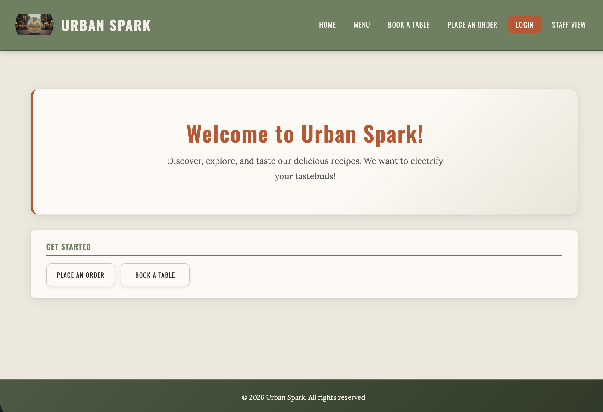

### What You See:
- **Top navigation bar** with links: HOME, MENU, BOOK A TABLE, PLACE AN ORDER, LOGIN, STAFF VIEW
- A welcome message: *"Welcome to Urban Spark! Discover, explore, and taste our delicious recipes."*
- Two big buttons in the **Get Started** section:
  - **PLACE AN ORDER** — Takes you directly to the menu to order food
  - **BOOK A TABLE** — Takes you to reserve a table at the restaurant

### What To Do:
- If you just want to **look at the menu**, click **MENU** in the top bar
- If you want to **order food**, click **PLACE AN ORDER**
- If you want to **reserve a table**, click **BOOK A TABLE**
- If you have an account, click **LOGIN** to sign in

---

## 2. Browsing the Menu (No Login Required)

**URL:** `http://127.0.0.1:8000/menu-item/`

You do **not** need to create an account to browse the menu. Simply click **MENU** in the top navigation bar.

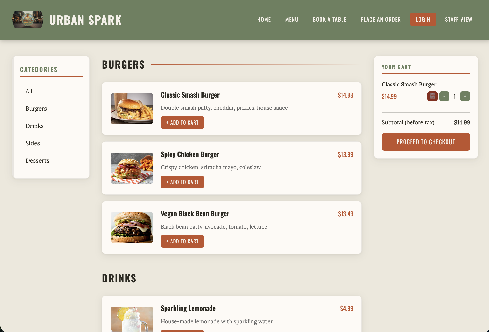

### What You See:
- **Left sidebar — Categories:** Click any category to jump to it:
  - All, Burgers, Drinks, Sides, Desserts
- **Main area — Menu Items:** Each item shows:
  - A photo (or placeholder)
  - Name and description
  - Price
  - **"+ ADD TO CART"** button
- **Right sidebar — Your Cart:** Shows items you've added

### Menu Items Available:
| Category | Item | Price |
|----------|------|-------|
| Burgers | Classic Smash Burger | $14.99 |
| Burgers | Spicy Chicken Burger | $13.99 |
| Burgers | Vegan Black Bean Burger | $13.49 |
| Drinks | Sparkling Lemonade | $4.99 |
| Drinks | Craft Root Beer | $5.99 |
| Sides | Loaded Fries | $8.99 |
| Sides | Onion Rings | $6.99 |
| Desserts | Chocolate Lava Cake | $9.99 |

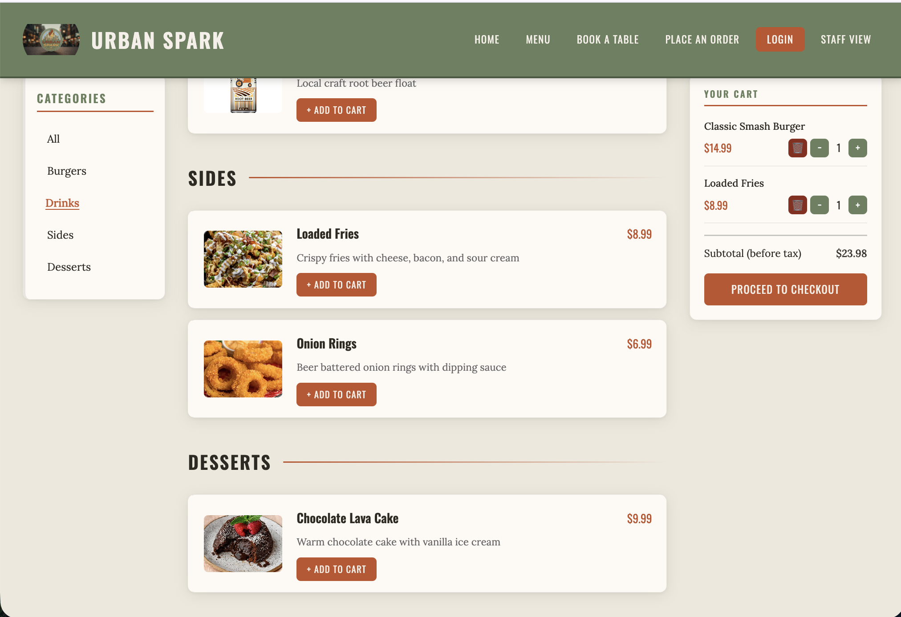

> **Tip:** Click a category name on the left to scroll directly to that section.

---

## 3. Booking a Table (No Login Required)

**URL:** `http://127.0.0.1:8000/reservation/new/`

You can book a table without logging in. Click **BOOK A TABLE** in the top navigation.

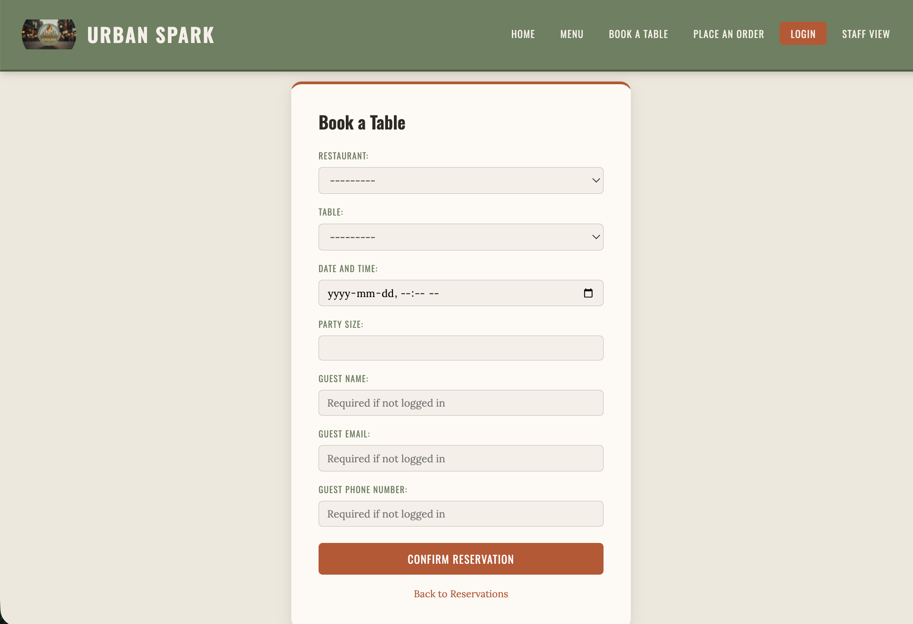

### How to Book a Table:

**Step 1:** Select a **Restaurant** from the dropdown (e.g., "Urban Spark Downtown")

**Step 2:** Select a **Table** from the dropdown

**Step 3:** Pick a **Date and Time** using the date/time picker

**Step 4:** Enter your **Party Size** (how many people)

**Step 5 (If not logged in):** Fill in:
- Guest Name
- Guest Email
- Guest Phone Number

**Step 6:** Click **Book Table**

> **Note:** If you are already logged in as a customer, the Guest Name, Email, and Phone fields will be filled in automatically from your profile.

---

## 4. Customer Accounts

### 4.1 Creating a Customer Account (Sign Up)

**URL:** `http://127.0.0.1:8000/restaurant/customer_signup/`

If you don't have an account yet, click **LOGIN** in the top bar, then click the **Sign Up** link.

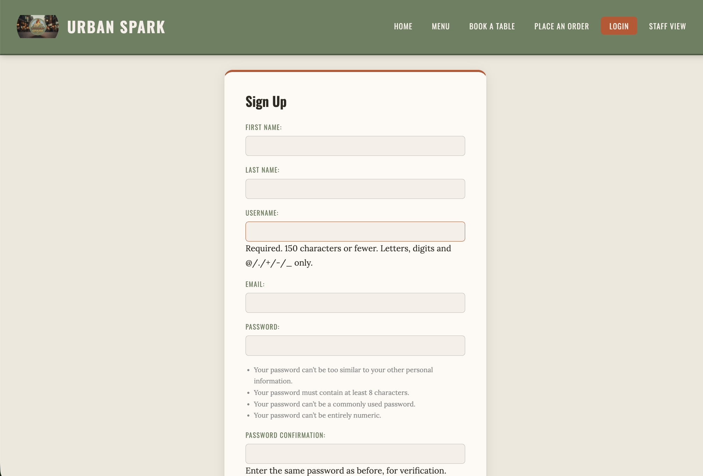

### How to Sign Up:

**Step 1:** Fill in your **First Name**

**Step 2:** Fill in your **Last Name**

**Step 3:** Choose a **Username** (letters, numbers, and @/./+/-/_ only, max 150 characters)

**Step 4:** Enter your **Email** address

**Step 5:** Create a **Password** (must be at least 8 characters, not too simple)

**Step 6:** Click **Sign Up**

> **Password Rules:** Your password cannot be similar to your name, must be 8+ characters, cannot be a commonly used password, and cannot be all numbers.

---

### 4.2 Logging In as a Customer

**URL:** `http://127.0.0.1:8000/restaurant/customer_login/`

Click **LOGIN** in the top navigation bar.

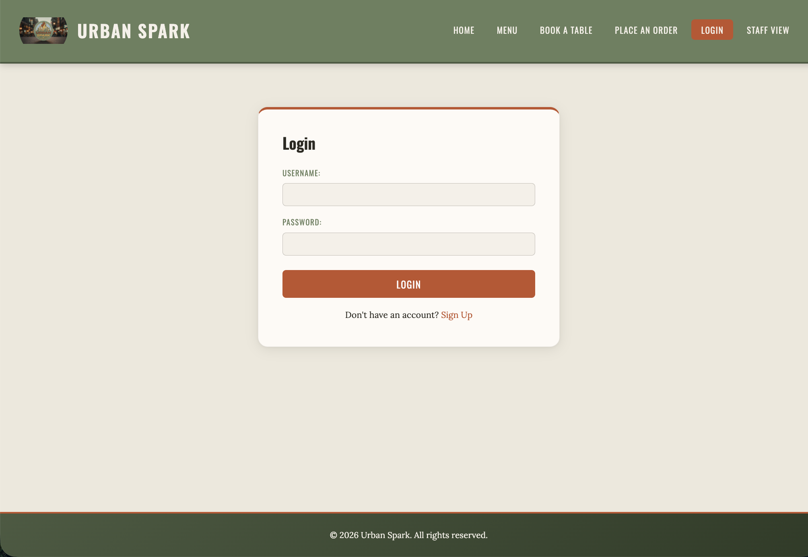

### How to Log In:

**Step 1:** Type your **Username** in the Username field

**Step 2:** Type your **Password** in the Password field

**Step 3:** Click the **LOGIN** button

**Step 4:** You will be taken to your **Dashboard** and see "Login Successful!"

> **Don't have an account?** Click the **Sign Up** link below the LOGIN button.

---

### 4.3 Customer Dashboard

**URL:** `http://127.0.0.1:8000/customer/dashboard/`

After logging in, you arrive at your personal dashboard.

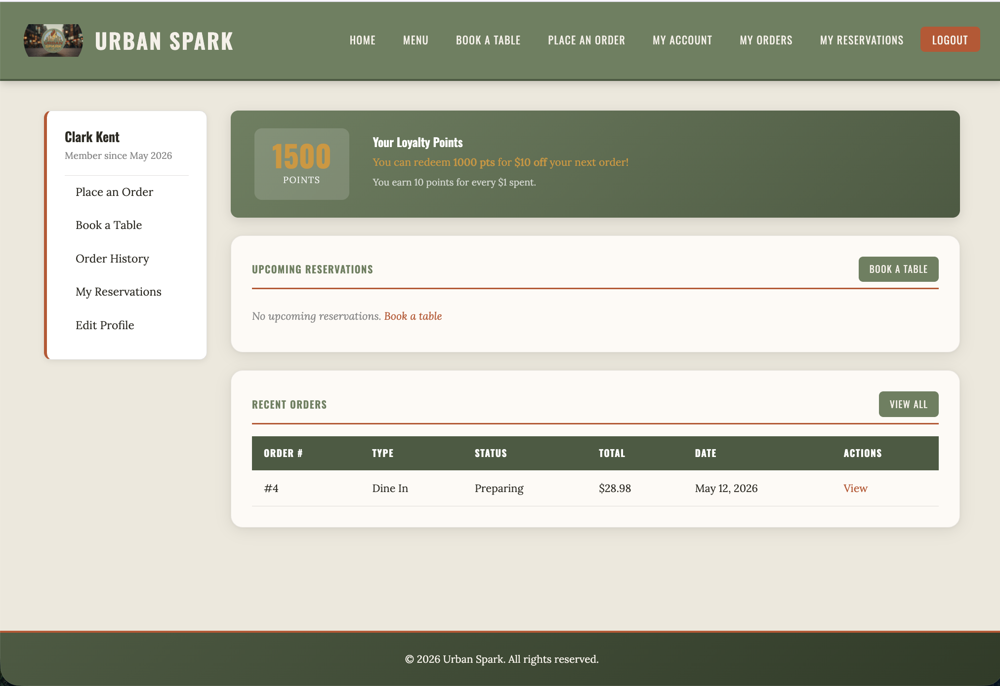

### What You See:
- **Your name** and member-since date in the left sidebar
- **Left sidebar links:**
  - Place an Order
  - Book a Table
  - Order History
  - My Reservations
  - Edit Profile
- **Loyalty Points box** — Shows your current points balance. You earn **10 points for every $1 spent**. You can redeem **1000 pts for $10 off** your next order!
- **Upcoming Reservations** — Your confirmed table bookings
- **Recent Orders** — Your last few orders with status and totals

---

### 4.4 Placing an Order

**URL:** `http://127.0.0.1:8000/menu-item/`

Click **PLACE AN ORDER** in the top navigation or from your dashboard sidebar.

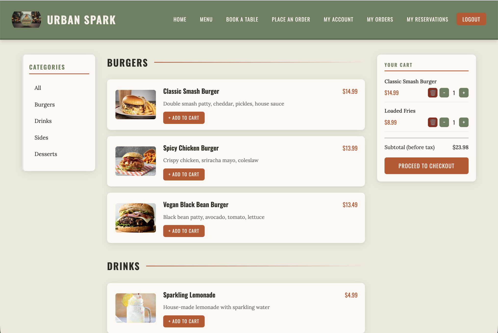

### How to Order:

**Step 1:** Browse the menu. Use the **Categories** on the left to filter by Burgers, Drinks, Sides, or Desserts.

**Step 2:** Click **"+ ADD TO CART"** next to any item you want.

**Step 3:** The item appears in the **Your Cart** panel on the right side.

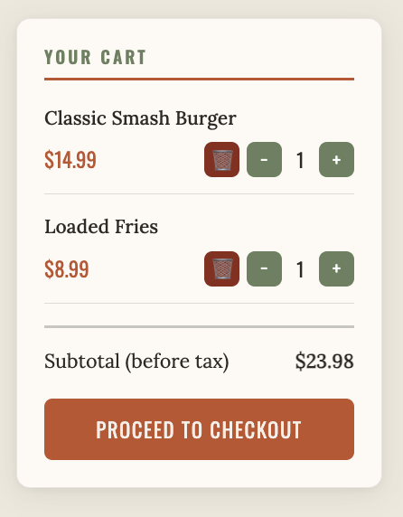

**Step 4:** In the cart you can:
- Use **+** and **−** buttons to change quantities
- See the **Subtotal (before tax)**

**Step 5:** When ready, click **PROCEED TO CHECKOUT**

---

### 4.5 Checkout & Loyalty Points

**URL:** `http://127.0.0.1:8000/order/new/`

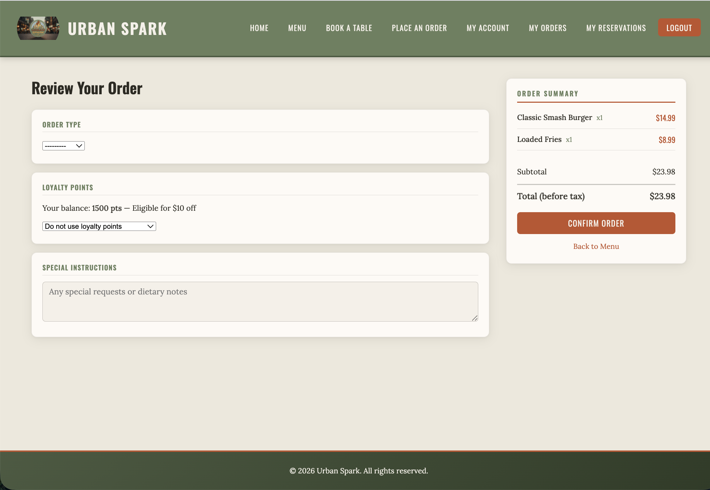

### How to Complete Your Order:

**Step 1:** Choose your **Order Type** from the dropdown:
- Dine In (eating at the restaurant)
- Take Out (picking it up yourself)
- Delivery (delivered to your address)

**Step 2:** Choose whether to **use Loyalty Points**:
- If you have 1000+ points, you can apply $10 off
- Select from the Loyalty Points dropdown

**Step 3:** Add any **Special Instructions** (allergies, preferences, etc.)

**Step 4:** Check the **Order Summary** on the right — it shows what you're ordering and the total

**Step 5:** Click **CONFIRM ORDER**

> **Loyalty Points:** You earn 10 points for every $1 you spend. Once you have 1000 points, you can redeem them for $10 off your next order!

---

### 4.6 Viewing Your Orders

**URL:** `http://127.0.0.1:8000/order/`

Click **MY ORDERS** in the top navigation bar.

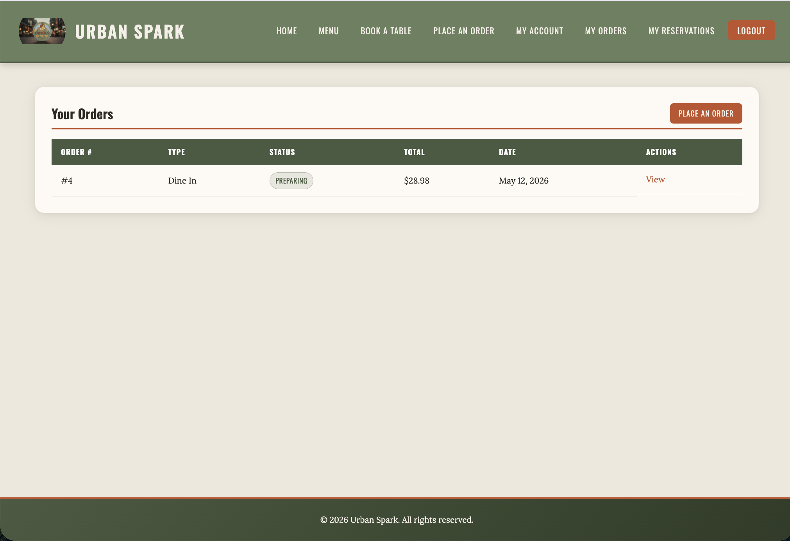

### What You See:
- A table of all your orders with:
  - **Order #** — The order number
  - **Type** — Dine In, Take Out, or Delivery
  - **Status** — Current status (Pending, Preparing, Ready, etc.)
  - **Total** — The order total
  - **Date** — When you placed it
  - **Actions** — Click **View** to see details

### Order Detail Page:

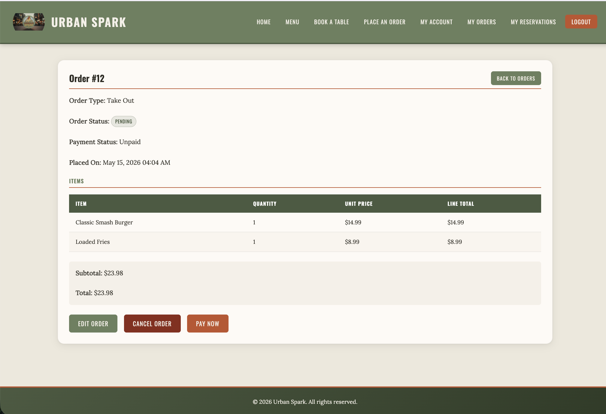

Clicking **View** shows you:
- Order Type and Status
- Payment Status (Paid or Unpaid)
- When it was placed
- Items in the order
- Total amount
- A **PAY NOW** button (if payment is still due)

---

### 4.7 Viewing Your Reservations

**URL:** `http://127.0.0.1:8000/reservation/`

Click **MY RESERVATIONS** in the top navigation bar.

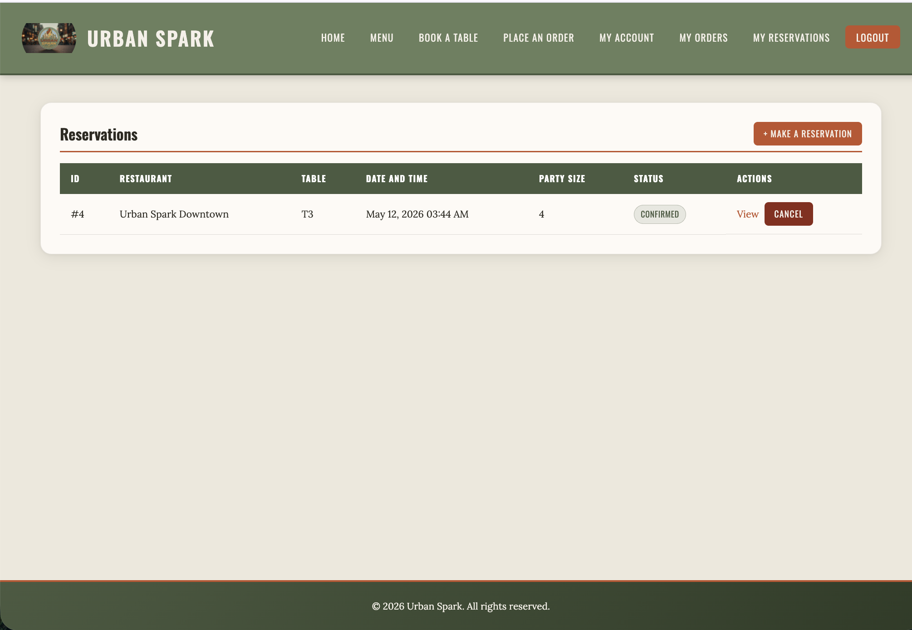

### What You See:
- A table showing all your reservations with:
  - **ID** — Reservation number
  - **Restaurant** — Which restaurant
  - **Table** — Which table (e.g., T3)
  - **Date and Time** — When your reservation is
  - **Party Size** — How many people
  - **Status** — Confirmed, Pending, or Cancelled
  - **Actions** — **View** (see details) or **CANCEL** (cancel your reservation)

> **To make a new reservation:** Click the **+ MAKE A RESERVATION** button at the top right.

---

### 4.8 Editing Your Profile

**URL:** `http://127.0.0.1:8000/restaurant/customer/{your-id}/edit/`

From your dashboard, click **MY ACCOUNT** in the top nav, or click **Edit Profile** in the sidebar.

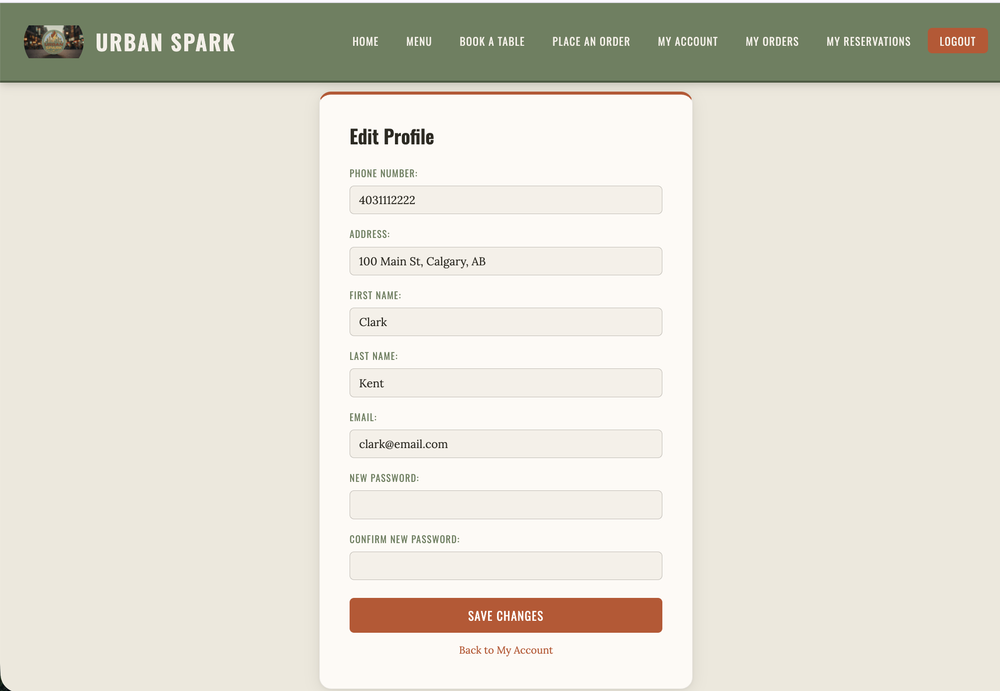

### What You Can Edit:
- **Phone Number**
- **Address**
- **First Name**
- **Last Name**
- **Email**
- **New Password** (leave blank to keep current password)
- **Confirm New Password**

Click **Save** (scroll down) when done.

---

## 5. Staff Login

**URL:** `http://127.0.0.1:8000/restaurant/staff_login/`

Staff members (managers, kitchen staff, drivers, server hosts, owners) use a **different login page** from customers.

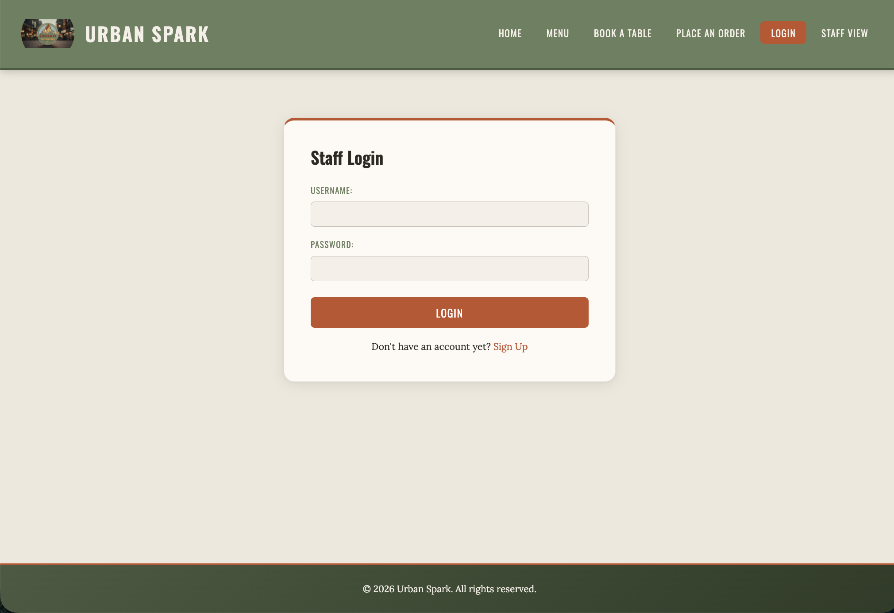

### How to Log In as Staff:

**Step 1:** Go to `http://127.0.0.1:8000/restaurant/staff_login/` or click **STAFF VIEW** in the top navigation bar.

**Step 2:** Enter your **Username**

**Step 3:** Enter your **Password**

**Step 4:** Click **LOGIN**

> You will be taken to the dashboard that matches your role (Manager, Kitchen, Driver, Owner, or Server/Host).

> **New staff?** Click **Sign Up** below the login button (you'll need an invite code from your manager).

---

## 6. Manager Role

**Login:** username `manager1`, password `TestPass123!`

### 6.1 Manager Dashboard

**URL:** `http://127.0.0.1:8000/restaurant/manager/`

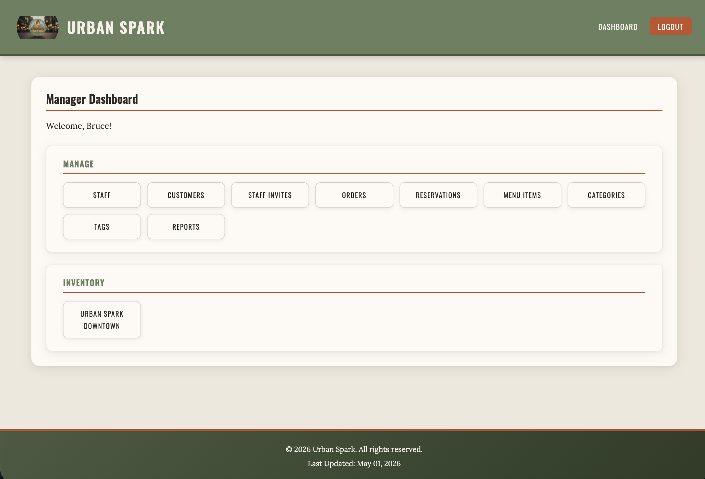

The Manager Dashboard is your control centre. It has two sections:

**MANAGE section** — Click any button to manage that area:
- **STAFF** — View and manage all staff members
- **CUSTOMERS** — View all customer accounts
- **STAFF INVITES** — Send invitations to new staff
- **ORDERS** — View and manage all orders
- **RESERVATIONS** — View and manage all reservations
- **MENU ITEMS** — View the menu
- **CATEGORIES** — Manage menu categories
- **TAGS** — Manage menu item tags
- **REPORTS** — View sales reports and inventory status

**INVENTORY section** — Click **URBAN SPARK DOWNTOWN** to manage that restaurant's inventory.

---

### 6.2 Managing Staff

**URL:** `http://127.0.0.1:8000/staff/`

Click **STAFF** on the Manager Dashboard.

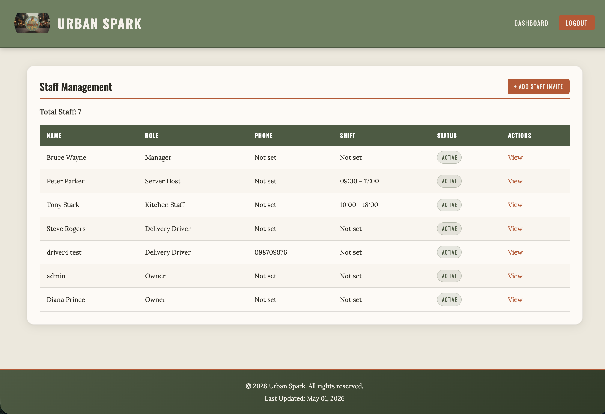

### What You See:
- **Total Staff count** at the top
- A table with each staff member showing:
  - Name, Role, Phone, Shift hours, Status (Active/Inactive)
  - **View** button to see their details and assigned orders

### To Add New Staff:
Click **+ ADD STAFF INVITE** (see Section 6.3 for the invite process)

### Staff Roles Available:
- Manager
- Server Host
- Kitchen Staff
- Delivery Driver
- Owner

---

### 6.3 Staff Invites

**URL:** `http://127.0.0.1:8000/staff-invites/`

Click **STAFF INVITES** on the Manager Dashboard.

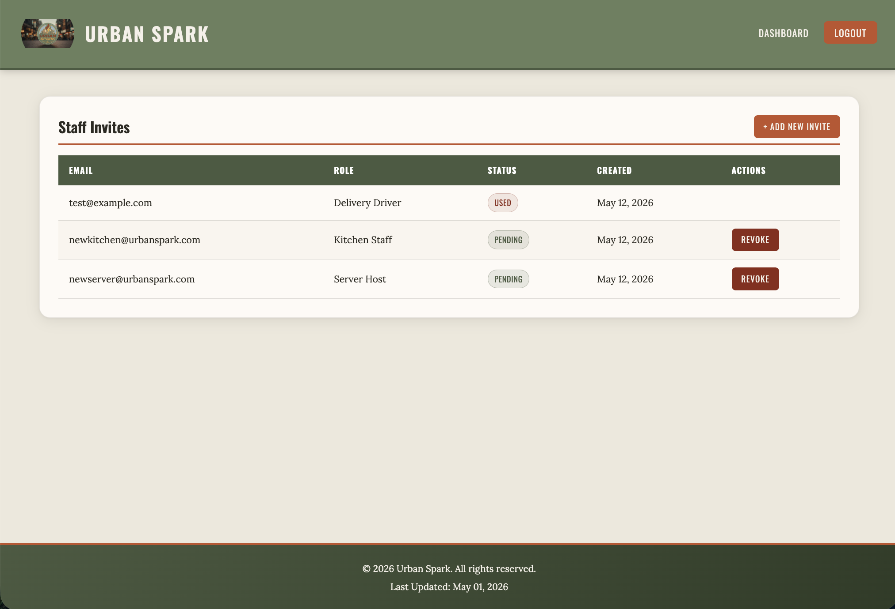

### What You See:
- A list of all sent invites showing:
  - Email address, Role, Status (Pending/Used), Date created
  - **REVOKE** button to cancel pending invites

### How to Invite a New Staff Member:

**Step 1:** Click **+ ADD NEW INVITE**

**Step 2:** Enter the new staff member's email address

**Step 3:** Select their role (e.g., Kitchen Staff, Server Host, etc.)

**Step 4:** Click **Send Invite**

**Step 5:** The staff member receives the invite, visits the sign-up link, and creates their account

---

### 6.4 Managing Customers

**URL:** `http://127.0.0.1:8000/customer/`

Click **CUSTOMERS** on the Manager Dashboard.

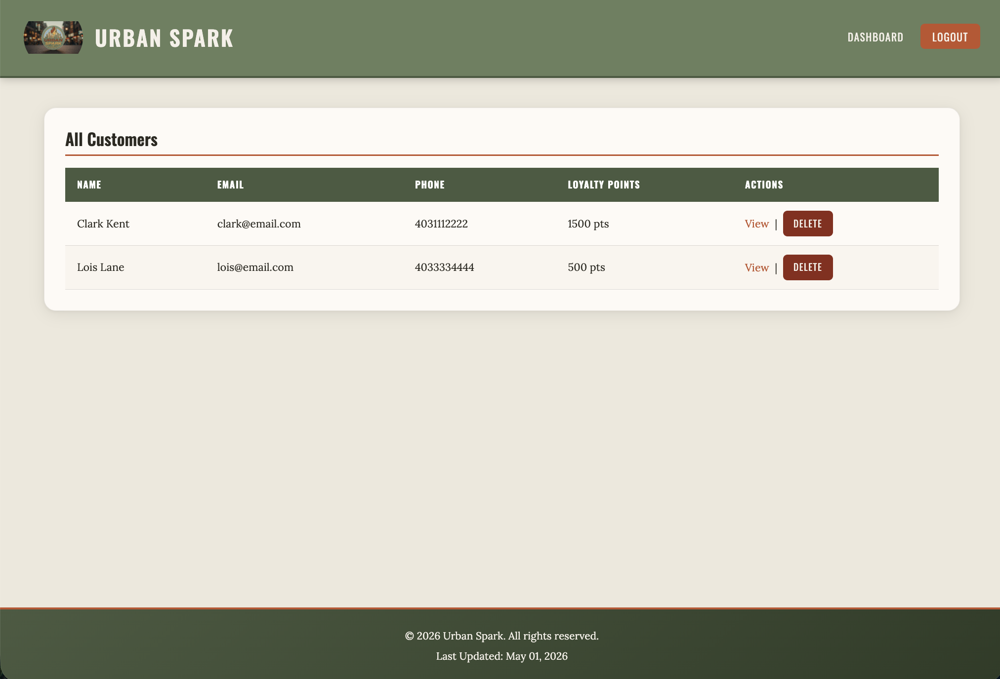

### What You See:
- A table of all customers with:
  - Name, Email, Phone, Loyalty Points
  - **View** button to see their full profile
  - **DELETE** button to remove their account

---

### 6.5 Managing Orders (Manager View)

**URL:** `http://127.0.0.1:8000/order/`

Click **ORDERS** on the Manager Dashboard.

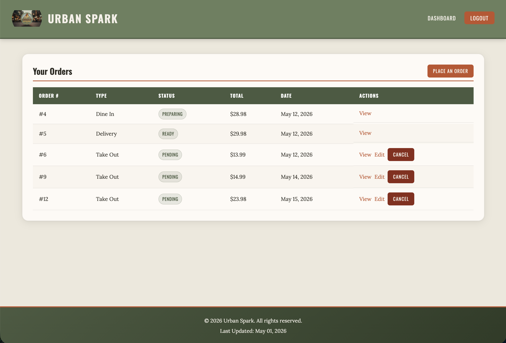

### What You See:
- All orders across all customers with:
  - Order #, Type, Status, Total, Date
  - **View** — See full order details
  - **Edit** — Edit the order
  - **CANCEL** — Cancel the order

### Order Status Types:
- **Pending** — Just placed, not yet started
- **Preparing** — Kitchen is working on it
- **Ready** — Ready for pickup or delivery
- **Out for Delivery** — Driver is delivering it
- **Delivered** — Successfully delivered

---

### 6.6 Managing Reservations (Manager View)

**URL:** `http://127.0.0.1:8000/reservation/`

Click **RESERVATIONS** on the Manager Dashboard.

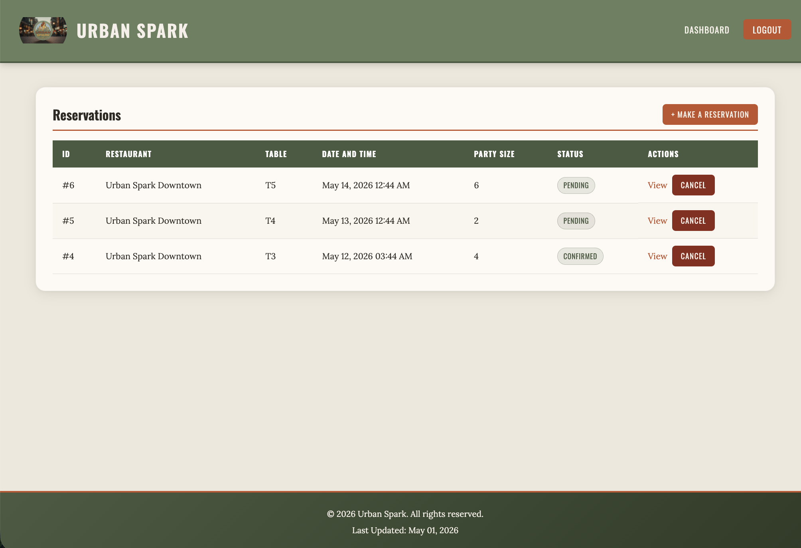

### What You See:
- All reservations with restaurant, table, date/time, party size, and status
- **View** button to see details
- **CANCEL** button to cancel a reservation

---

### 6.7 Menu Items (Staff Preview)

**URL:** `http://127.0.0.1:8000/menu-item/`

Click **MENU ITEMS** on the Manager Dashboard.

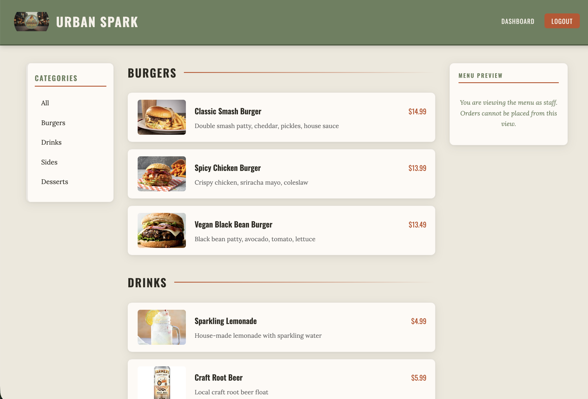

> **Note:** When you view the menu as a staff member, you'll see "You are viewing the menu as staff. Orders cannot be placed from this view." This is just a preview — you cannot order from here.

---

### 6.8 Categories

**URL:** `http://127.0.0.1:8000/category/`

Click **CATEGORIES** on the Manager Dashboard.

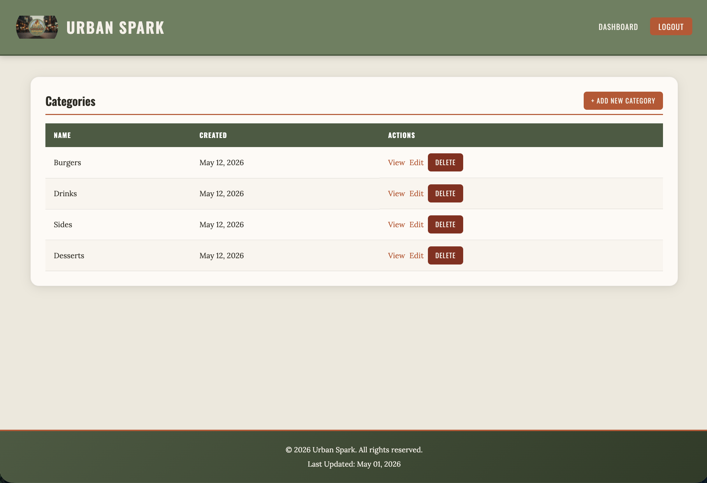

### What You Can Do:
- **View** all categories (Burgers, Drinks, Sides, Desserts)
- **Edit** a category name
- **DELETE** a category
- **+ ADD NEW CATEGORY** — Create a new menu category

---

### 6.9 Tags

**URL:** `http://127.0.0.1:8000/tag/`

Click **TAGS** on the Manager Dashboard.

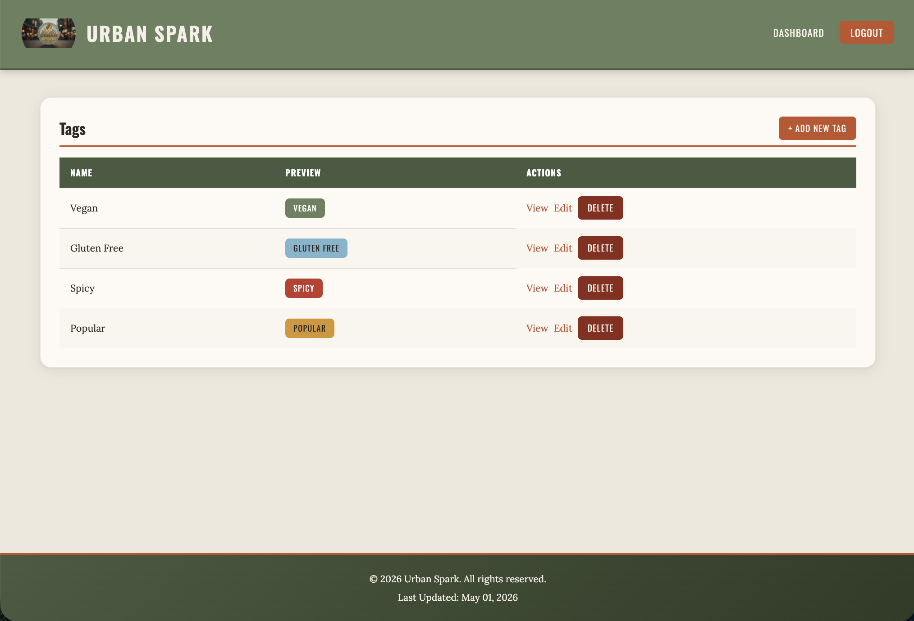

Tags are labels that appear on menu items to highlight special qualities. Current tags include: Vegan, Gluten Free, Spicy, Popular.

### What You Can Do:
- **View** all tags with their colour-coded previews
- **Edit** a tag
- **DELETE** a tag
- **+ ADD NEW TAG** — Create a new tag (e.g., "New Arrival")

---

### 6.10 Reports & Inventory Overview

**URL:** `http://127.0.0.1:8000/reporting/`

Click **REPORTS** on the Manager Dashboard.

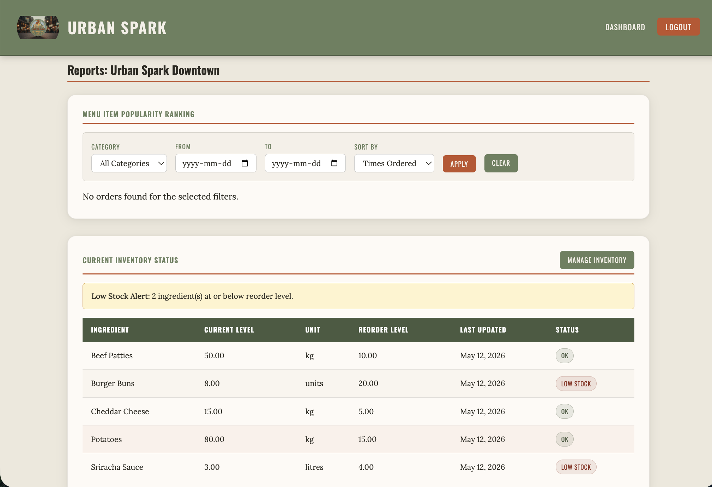

### What You See:

**Top Section — Menu Item Popularity Ranking:**
- Filter by **Category**, **Date range** (From / To), and **Sort By** (Times Ordered)
- Click **APPLY** to filter results
- Click **CLEAR** to reset filters

**Bottom Section — Current Inventory Status:**

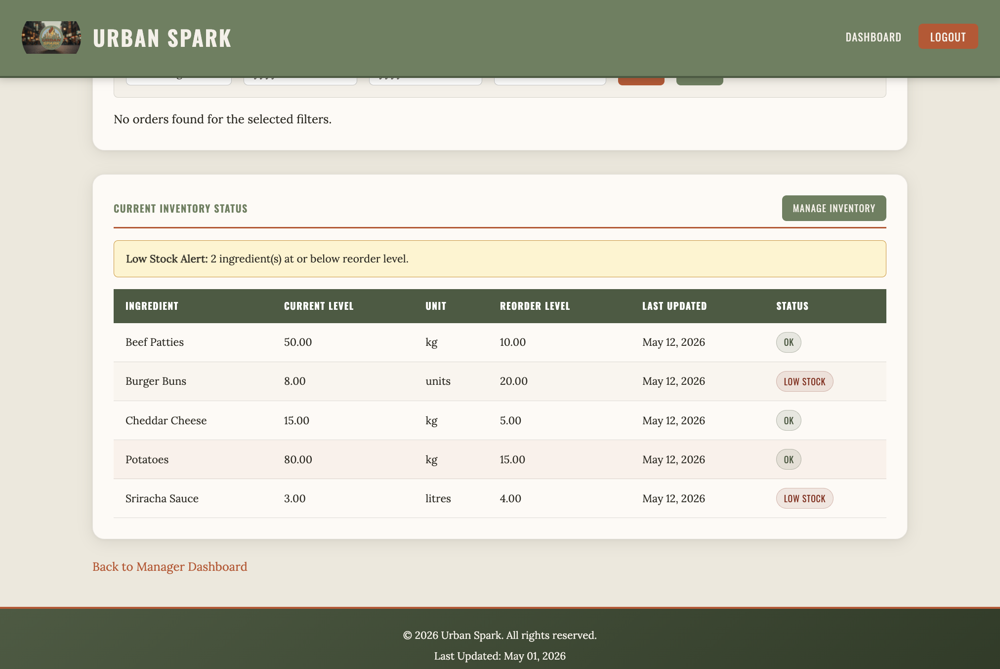

- A yellow alert shows if any ingredients are **LOW STOCK**
- Table shows: Ingredient, Current Level, Unit, Reorder Level, Last Updated, Status
- Click **MANAGE INVENTORY** to go to the full inventory page

---

### 6.11 Inventory Management

**URL:** `http://127.0.0.1:8000/restaurant/2/inventory/`

From the Manager Dashboard, click **URBAN SPARK DOWNTOWN** under the Inventory section.

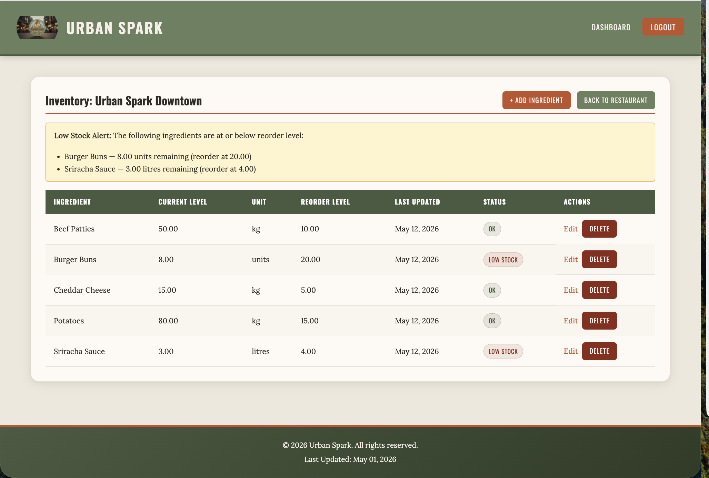

### What You See:
- A yellow alert listing any **LOW STOCK** ingredients
- Table showing each ingredient with:
  - Name, Current Level, Unit (kg/litres/units), Reorder Level, Last Updated, Status
- Status badges: **OK** (green) or **LOW STOCK** (orange/red)

### What You Can Do:
- **Edit** — Click to update the current stock level or reorder level for an ingredient
- **DELETE** — Remove an ingredient from tracking
- **+ ADD INGREDIENT** — Add a new ingredient to track

---

### 6.12 Restaurant Details

**URL:** `http://127.0.0.1:8000/restaurant/2/`

From the Restaurants list, click **View** next to a restaurant.

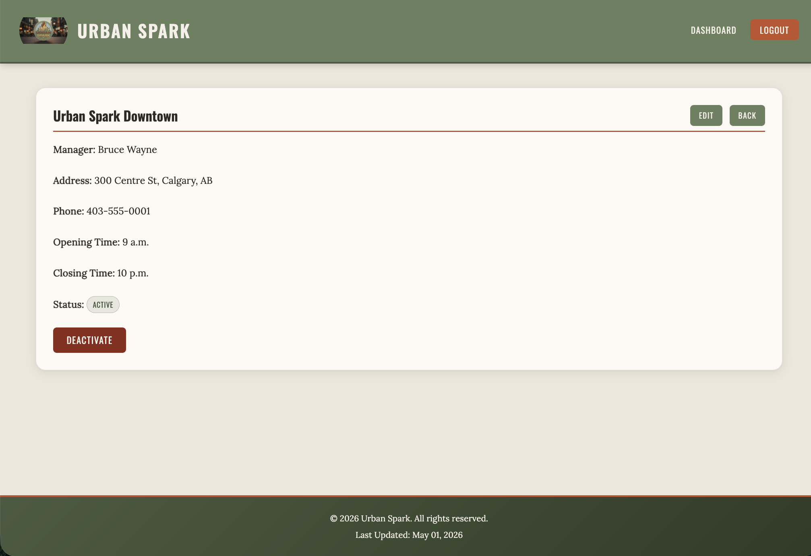

### What You See:
- Restaurant name, manager, address, phone number
- Opening and closing times
- Active/Inactive status
- **EDIT** — Edit restaurant details
- **DEACTIVATE** — Temporarily close the restaurant (makes it inactive)

---

### 6.13 Table Management

**URL:** `http://127.0.0.1:8000/restaurant/2/table/`

From a restaurant's detail page, navigate to the tables list.

Tables are listed as: T1 – 2 – 1 (meaning Table 1, 2 seats, status 1)

Clicking a table name takes you to its detail page showing:
- Seats, Assigned Server, and Status (Available/Occupied/Reserved/Needs Cleaning)
- **EDIT**, **DELETE**, and **BACK** buttons

---

## 7. Owner Role

**Login:** username `owner1`, password `TestPass123!`
**URL:** `http://127.0.0.1:8000/restaurant/owner/`

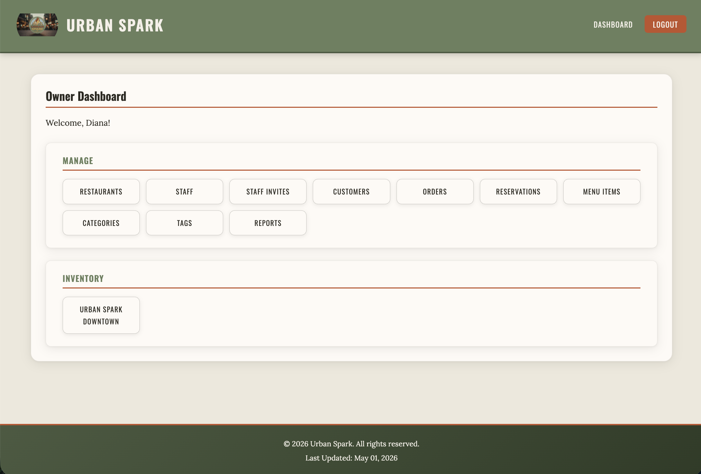

The Owner Dashboard is very similar to the Manager Dashboard but also includes a **RESTAURANTS** button in the Manage section, giving the Owner control over the restaurant locations themselves.

### Owner vs Manager Comparison:
| Feature | Manager | Owner |
|---------|---------|-------|
| Staff Management | ✅ | ✅ |
| Customer Management | ✅ | ✅ |
| Orders | ✅ | ✅ |
| Reservations | ✅ | ✅ |
| Menu Items | ✅ | ✅ |
| Categories & Tags | ✅ | ✅ |
| Reports | ✅ | ✅ |
| Inventory | ✅ | ✅ |
| **Restaurants** | ❌ | ✅ |

> The Owner (owner1 = Diana Prince) has the highest level of access and can manage the restaurant locations, including creating new ones.

---

## 8. Server / Host Role

**URL:** `http://127.0.0.1:8000/restaurant/server/`

The Server/Host role is for front-of-house staff who manage the dining room tables.

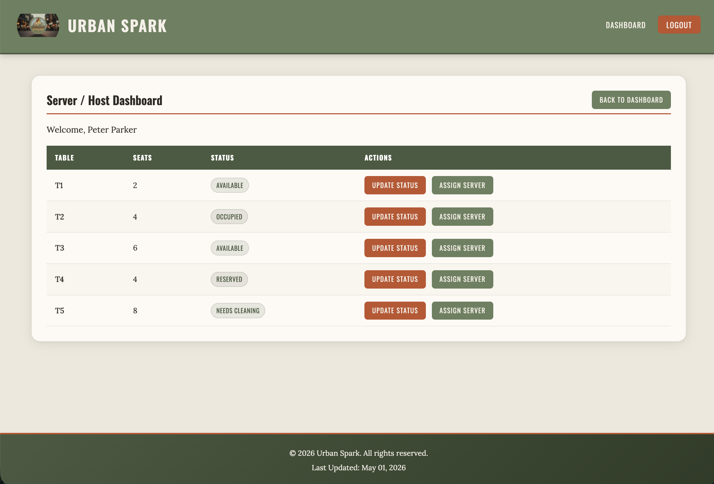

### What You See:
- A table of all restaurant tables with:
  - **TABLE** — Table number (T1, T2, etc.)
  - **SEATS** — How many people it can seat
  - **STATUS** — Current status:
    - **AVAILABLE** (green) — Table is empty and ready
    - **OCCUPIED** (orange) — Guests are seated
    - **RESERVED** (blue) — Booked but guests not yet arrived
    - **NEEDS CLEANING** (yellow) — Table needs to be cleaned
  - **Actions:**
    - **UPDATE STATUS** — Change the table status
    - **ASSIGN SERVER** — Assign a server to the table

### How to Update a Table Status:

**Step 1:** Click **UPDATE STATUS** next to the table

**Step 2:** Select the new status from the dropdown

**Step 3:** Click **Update**

### How to Assign a Server to a Table:

**Step 1:** Click **ASSIGN SERVER** next to the table

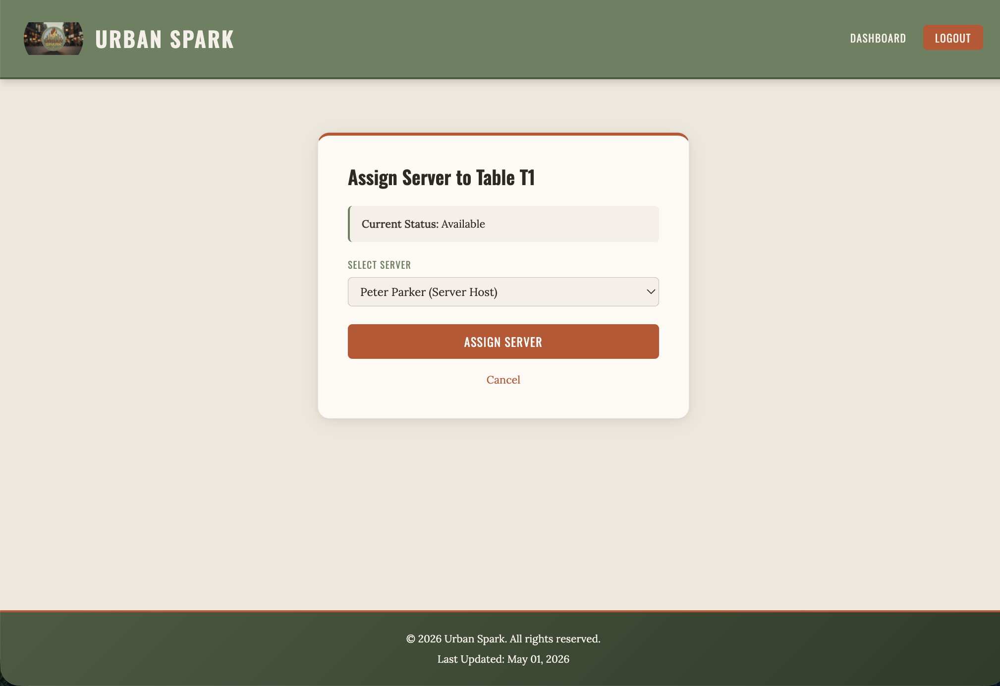

**Step 2:** Select a server from the **Select Server** dropdown

**Step 3:** Click **ASSIGN SERVER**

> **Note:** The Server/Host role is accessed via the staff login at `/restaurant/staff_login/`. The username for this role in your system corresponds to the Server Host staff account (Peter Parker).

---

## 9. Kitchen Staff Role (kitchen1)

**Login:** username `kitchen1`, password `TestPass123!`
**URL:** `http://127.0.0.1:8000/restaurant/kitchen/`

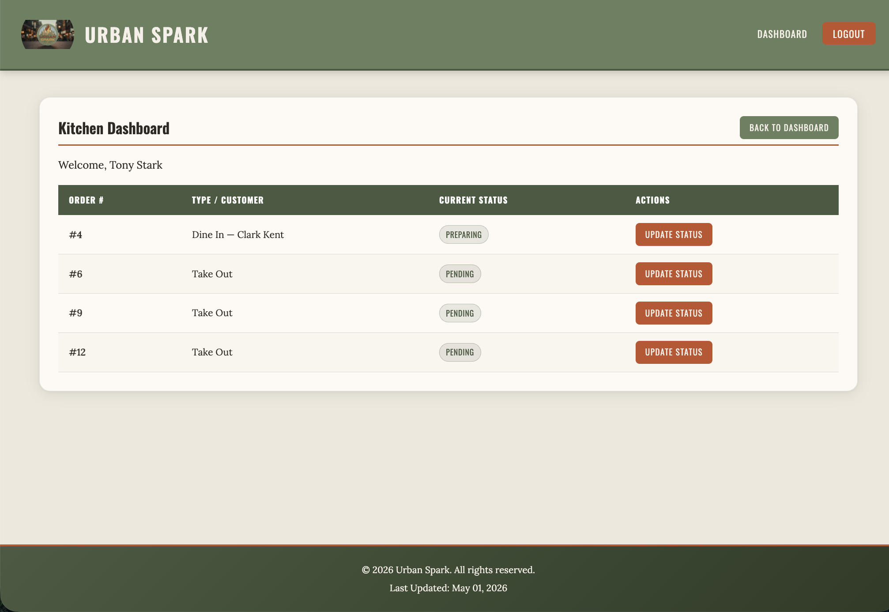

The Kitchen Dashboard shows all active orders that the kitchen needs to prepare.

### What You See:
- Welcome message with the kitchen staff's name (Tony Stark)
- A table of all orders with:
  - **ORDER #** — Order number
  - **TYPE / CUSTOMER** — Whether it's Dine In, Take Out, or Delivery, and the customer name
  - **CURRENT STATUS** — The current preparation status
  - **UPDATE STATUS** button — Click to update the order

### How to Update an Order Status:

**Step 1:** Click **UPDATE STATUS** next to the order you want to update

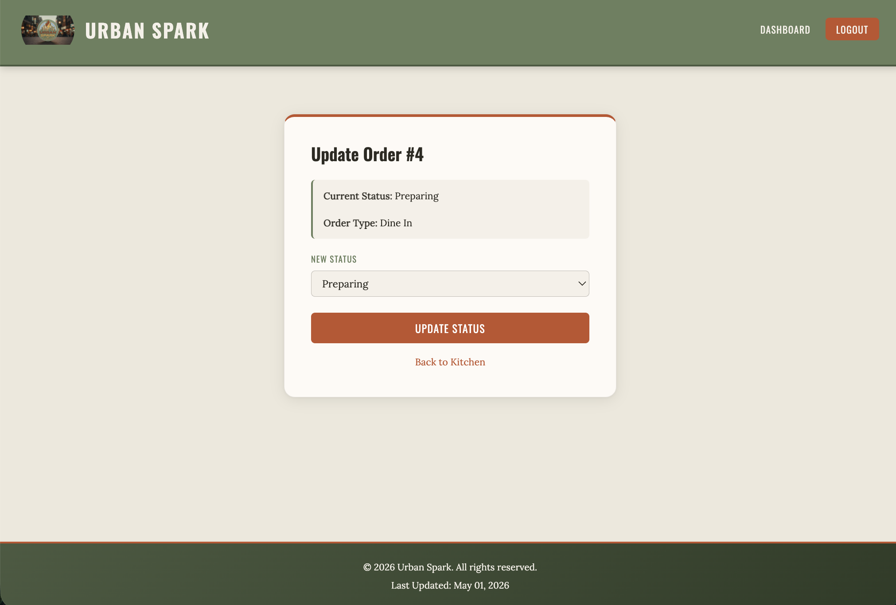

**Step 2:** You see the current status and order type

**Step 3:** Use the **New Status** dropdown to select a new status:
- Pending → Preparing → Ready

**Step 4:** Click **UPDATE STATUS**

**Step 5:** Click **Back to Kitchen** to return to the dashboard

### Order Status Flow for Kitchen:
```
PENDING → PREPARING → READY
```

> Once marked **READY**, the order is ready for the customer (dine-in/takeout) or the driver (delivery).

---

## 10. Delivery Driver Role (driver1)

**Login:** username `driver1`, password `TestPass123!`
**URL:** `http://127.0.0.1:8000/restaurant/driver/`

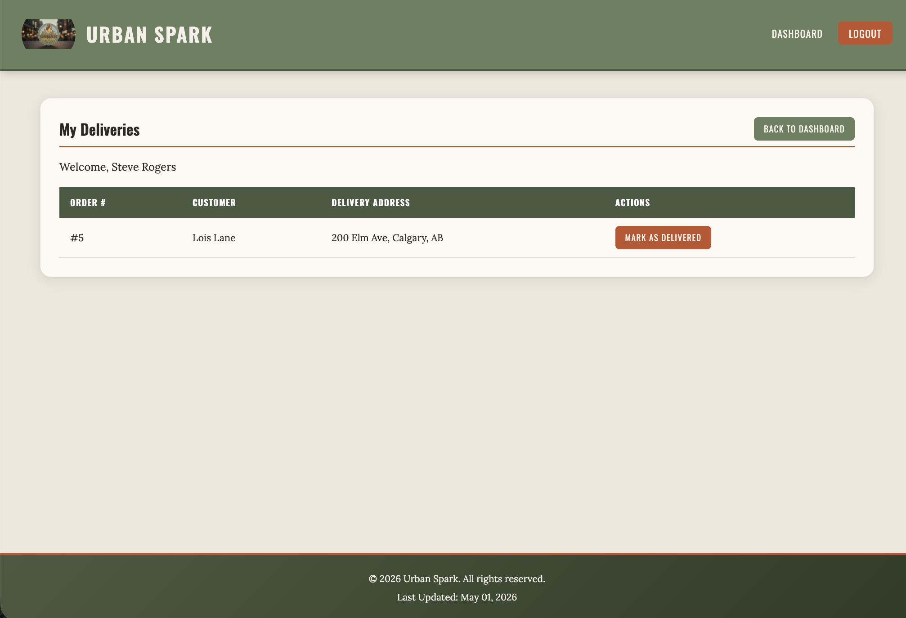

The Driver Dashboard shows all delivery orders assigned to this driver.

### What You See:
- Welcome message with the driver's name (Steve Rogers)
- A table of assigned deliveries with:
  - **ORDER #** — The order number
  - **CUSTOMER** — Who placed the order
  - **DELIVERY ADDRESS** — Where to deliver it
  - **MARK AS DELIVERED** button

### How to Complete a Delivery:

**Step 1:** Pick up the order from the restaurant

**Step 2:** Deliver it to the address shown

**Step 3:** Click **MARK AS DELIVERED** next to the order

**Step 4:** The order status updates to "Delivered"

---

## 11. Staff Sign Up Process

New staff members cannot sign up on their own — they need to be **invited by a Manager or Owner**.

### Process for Managers/Owners:

**Step 1:** Log in as manager or owner

**Step 2:** Go to **STAFF INVITES**

**Step 3:** Click **+ ADD NEW INVITE**

**Step 4:** Enter the new staff member's email and select their role

**Step 5:** The invite is created with "Pending" status

### Process for New Staff Members:

**Step 1:** The manager shares the sign-up link: `http://127.0.0.1:8000/restaurant/staff_signup/`

**Step 2:** Fill in your details:

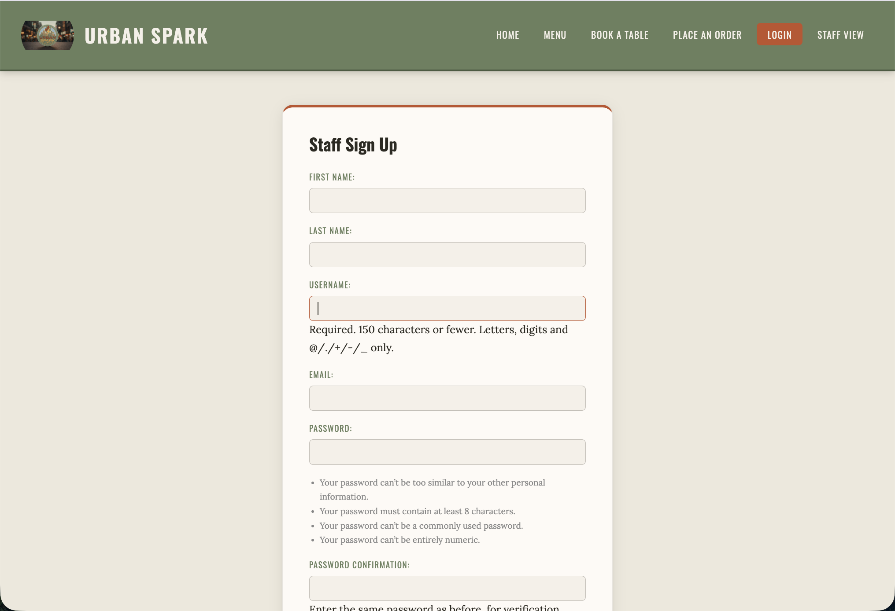

- First Name, Last Name, Username
- Email (must match the invited email)
- Password and Confirm Password
- Phone Number (optional)
- Address (optional)

**Step 3:** Click **SIGN UP**

**Step 4:** You can now log in at `http://127.0.0.1:8000/restaurant/staff_login/`

---

## 12. Quick Reference — Login URLs

| Who You Are | Login URL | After Login |
|-------------|-----------|-------------|
| Customer | `/restaurant/customer_login/` | Customer Dashboard |
| Manager | `/restaurant/staff_login/` | Manager Dashboard |
| Owner | `/restaurant/staff_login/` | Owner Dashboard |
| Kitchen Staff | `/restaurant/staff_login/` | Kitchen Dashboard |
| Delivery Driver | `/restaurant/staff_login/` | Driver Dashboard |
| Server/Host | `/restaurant/staff_login/` | Server/Host Dashboard |

### Staff Dashboard URLs:
| Role | Direct URL |
|------|-----------|
| Manager Dashboard | `/restaurant/manager/` |
| Owner Dashboard | `/restaurant/owner/` |
| Kitchen Dashboard | `/restaurant/kitchen/` |
| Driver Dashboard | `/restaurant/driver/` |
| Server/Host Dashboard | `/restaurant/server/` |

### Common Customer URLs:
| Page | URL |
|------|-----|
| Home | `/` |
| Menu | `/menu-item/` |
| Book a Table | `/reservation/new/` |
| My Dashboard | `/customer/dashboard/` |
| My Orders | `/order/` |
| My Reservations | `/reservation/` |

---

*Urban Spark User Guide — Last updated May 2026*
*For technical support, contact your system administrator.*
